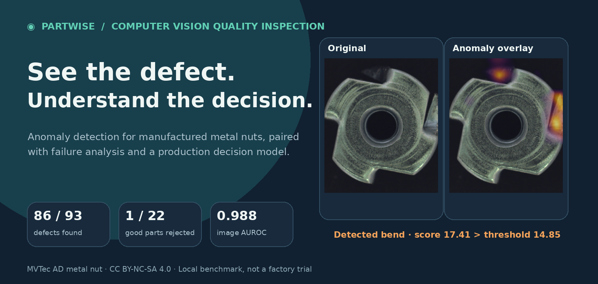
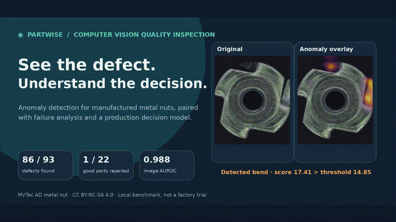
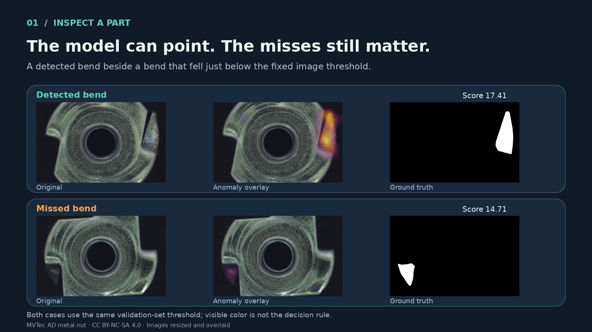
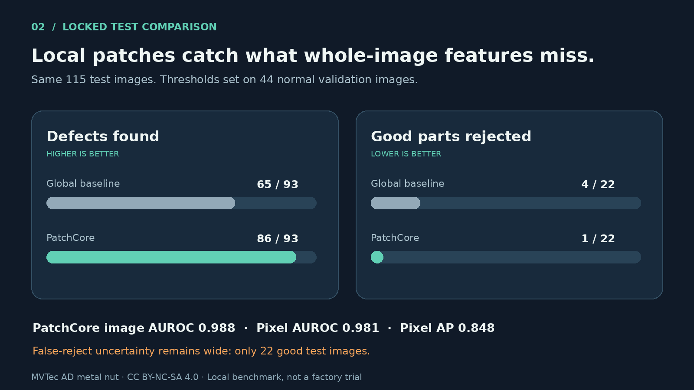
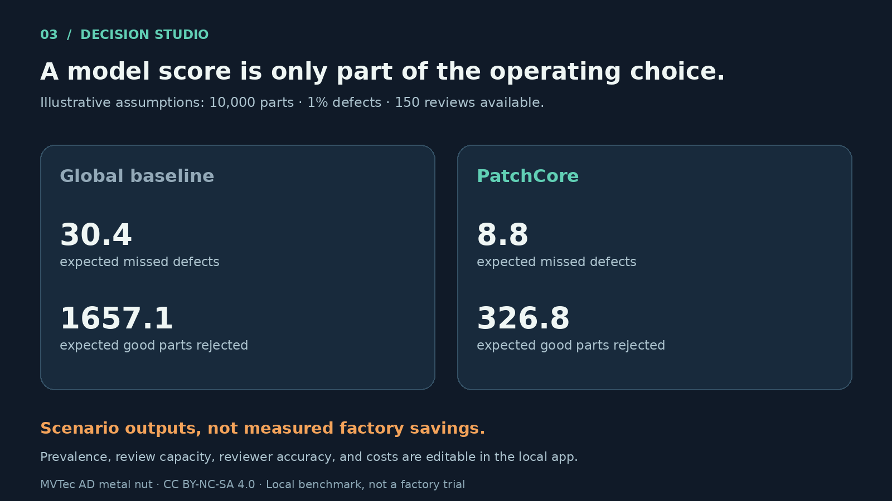

# ◉ Partwise

**Computer vision for industrial quality inspection, connecting model evidence to factory decisions.**




[▶ Watch the 20-second walkthrough](docs/assets/walkthrough.mp4) · [Explore the case study](reports/case_study.md) · [Read the measured comparison](reports/model_comparison.md)

## Why this project exists

A factory camera can identify a suspicious part, but that is not the whole inspection problem. A missed defect may reach the customer; a good part sent to scrap or review also has a cost. **Partwise** is a computer vision prototype that explores both sides of that decision with one manufactured-part benchmark: detect anomalies in metal nuts, show where the model found them, inspect its failures, and test how those errors affect an illustrative review workflow.

The project uses the [MVTec AD metal nut category](https://www.mvtec.com/research-teaching/datasets/mvtec-ad). Training uses **normal parts only**. Defective test images stay out of fitting and threshold selection.

## A quick tour

[](docs/assets/walkthrough.mp4)

*The video is rendered from saved benchmark outputs. Run the local Streamlit app below to inspect images and adjust the decision scenario.*

The inspector puts the original image, PatchCore anomaly overlay, and supplied defect mask side by side. It includes successful detections, seven missed defects, and the one good test image flagged for review.



## What the experiment found

The comparator is a whole-image ResNet18 feature distance. PatchCore compares **local** ResNet18 patch features with a compact bank of normal patches. Both use the same split and a threshold chosen from 44 normal validation images; the official 115-image test set is used for evaluation.

| Locked test measure | Whole-image baseline | PatchCore |
|---|---:|---:|
| Defects found | 65 / 93 | **86 / 93** |
| Good parts rejected | 4 / 22 | **1 / 22** |
| Image AUROC | 0.793 | **0.988** |
| Pixel AUROC | — | 0.981 |
| Pixel average precision | — | 0.848 |



PatchCore's defect recall is **92.5%**, with an approximate 95% Wilson interval of **85.3%–96.3%**. Its false-reject rate is **4.5%**, but the interval is **0.8%–21.8%** because only 22 good test images are available. The [comparison report](reports/model_comparison.md) breaks down defects by type, CPU timing, and failure cases. A [camera-condition stress test](reports/camera_stress_test.md) shows how small synthetic exposure and blur changes affect the same fixed model.

## From detection to action

The **Decision studio** turns measured defect recall and false-reject rates into an explicit scenario. You can change defect prevalence, human review capacity and accuracy, and the relative costs of missed defects, false rejects, and review. In the sample 10,000-part scenario, PatchCore projects fewer missed defects and fewer good parts rejected than the baseline.



These are **illustrative outputs, not measured factory savings**. The workbench makes assumptions visible so they can be questioned. A real deployment would need local camera data, actual prevalence and costs, and a larger good-part evaluation set.

## Tech stack and choices

| Layer | Choice | Why it is here |
|---|---|---|
| Language and data | Python 3.12, NumPy, Pillow | Reproducible image loading, transforms, scores, and artifacts. |
| Features and inference | PyTorch, torchvision, pretrained ResNet18 | One backbone supports a transparent global baseline and local patch features. |
| Anomaly model | Anomalib PatchCore | Normal-only fitting and spatial anomaly maps; a 0.5% coreset keeps CPU use practical. |
| Evaluation | scikit-learn, custom metric summaries | Pixel metrics, image decisions, uncertainty intervals, and per-case inspection. |
| Local demo | Streamlit, Altair | Fast, inspectable controls for images, comparisons, and decision scenarios. |
| Checks | pytest | Data, score, scenario, and CLI behavior checks. |

The batch-1 model-and-score median was **35.7 ms** for PatchCore on this CPU, measured across 20 preprocessed test images repeated three times. It excludes image loading, preprocessing, and UI rendering. See [the timing script](scripts/benchmark_latency.py) for the exact boundary.

## Run locally

**Prerequisites:** Python 3.12 and the metal nut folder from MVTec AD. Download the dataset from its [official page](https://www.mvtec.com/research-teaching/datasets/mvtec-ad), then place it so this path exists:

```text
data/mvtec_ad/metal_nut/train/good/
```

Create the environment and install the pinned CPU and demo dependencies:

```bash
python3.12 -m venv .venv
.venv/bin/python -m pip install -r requirements-demo.txt
.venv/bin/python -m pip install -e .
```

<details>
<summary>If your Python lacks ensurepip</summary>

On systems where normal `venv` creation cannot install pip, use:

```bash
python3.12 -m venv --without-pip .venv
python3.12 -m pip --python .venv install pip
.venv/bin/python -m pip install -r requirements-demo.txt
.venv/bin/python -m pip install -e .
```

</details>

Create the manifest and both model runs:

```bash
.venv/bin/python -m partwise audit \
  --data-root data/mvtec_ad \
  --output artifacts/metal_nut_manifest.json

.venv/bin/python -m partwise baseline \
  --data-root data/mvtec_ad \
  --manifest artifacts/metal_nut_manifest.json \
  --output artifacts/metal_nut_baseline.json

.venv/bin/python -m partwise patchcore \
  --data-root data/mvtec_ad \
  --manifest artifacts/metal_nut_manifest.json \
  --output artifacts/metal_nut_patchcore.json \
  --model-output artifacts/metal_nut_patchcore_model.pt \
  --maps-output artifacts/metal_nut_patchcore_maps.npz
```

The first model run retrieves pretrained ResNet18 weights. PatchCore fitting took about **47 seconds** on the development CPU. Open the workbench at **http://127.0.0.1:8501**:

```bash
.venv/bin/python -m streamlit run app.py --server.address 127.0.0.1
```

Run the checks or regenerate the figures and walkthrough:

```bash
.venv/bin/python -m pytest -q
.venv/bin/python scripts/stress_test_camera.py
.venv/bin/python scripts/make_readme_media.py
```

## Reproducibility and scope

- The manifest records the seeded split: **176 normal fitting**, **44 normal validation**, **22 good test**, and **93 defective test** images. Each defect mask is checked during the audit.
- Thresholds target a 5% false-reject rate on normal validation images. Official test labels are used for evaluation and failure analysis, never for calibration.
- Dataset images, fitted weights, heatmaps, and per-image scores live in ignored `data/` and `artifacts/`. The README media and [three-case figure](reports/figures/inspection_cases.png) are derived from benchmark examples.
- Original Partwise code is [MIT licensed](LICENSE). MVTec AD images and adapted visuals are credited separately in [Asset credits](docs/ASSET_CREDITS.md) under [CC BY-NC-SA 4.0](https://creativecommons.org/licenses/by-nc-sa/4.0/). This is a benchmark prototype; there is no hosted interactive app or production validation.

For the full methods and interpretation, see the [case study](reports/case_study.md), [model comparison](reports/model_comparison.md), [baseline report](reports/metal_nut_baseline.md), and [camera stress test](reports/camera_stress_test.md).
