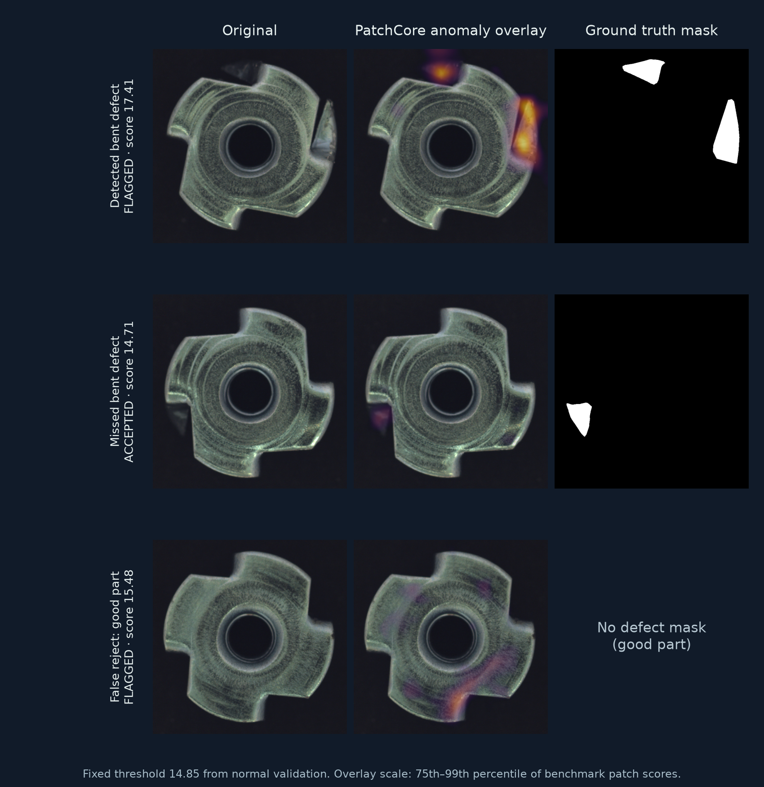

# Partwise: inspect the part, then inspect the decision

*Metal nut examples and masks from [MVTec AD](https://www.mvtec.com/research-teaching/datasets/mvtec-ad), distributed under [CC BY-NC-SA 4.0](https://creativecommons.org/licenses/by-nc-sa/4.0/). The overlays and figure were produced locally from the benchmark.*

## The problem

A quality-inspection model has two kinds of costly errors: a defect passing through and a good part being rejected. An inspection system should therefore show **where** the model sees an anomaly, **which** decisions it gets wrong, and **how** those errors interact with review capacity. Partwise combines a reproducible computer vision experiment with a small decision workbench.

## The experiment

I audited MVTec AD's metal nut category and kept its official test images separate. From the 220 normal training images, a seeded split assigned 176 to model fitting and 44 to threshold calibration. Both methods targeted a 5% false-reject rate on those 44 normal validation images. The 22 good and 93 defective official test images were used for evaluation, never threshold selection.

The simple comparator embeds a whole image with fixed pretrained ResNet18 features and scores cosine distance to the nearest normal training image. PatchCore instead compares spatial ResNet18 patch features with a compact memory bank of 689 normal patches. It uses 224 × 224 images and a 0.5% coreset, chosen to run on a laptop CPU. The two methods share the data split and evaluation protocol.

## What the locked test set showed

| Measure | Global baseline | PatchCore |
|---|---:|---:|
| Defects found | 65 / 93 | **86 / 93** |
| Good parts rejected | 4 / 22 | **1 / 22** |
| Image AUROC | 0.793 | **0.988** |
| Pixel AUROC | — | 0.981 |
| Pixel average precision | — | 0.848 |

PatchCore found 22 of 25 bent parts, 19 of 22 color defects, all 23 flipped parts, and 22 of 23 scratches. It still missed seven defects and rejected one good image. The figure above makes three of those decisions inspectable. Its overlay is a visualization of patch scores, while the accept/review decision uses the fixed image score threshold. In particular, a visible bright patch can exist on a **missed** defect without pushing its overall image score over the threshold.

The 95% Wilson intervals for PatchCore are **85.3%–96.3%** defect recall and **0.8%–21.8%** false-reject rate. The latter range is wide because the test set has only 22 good images. The measured batch-1 CPU median for model and scoring was **35.7 ms** on 20 preprocessed test images repeated three times; it excludes loading, preprocessing, and UI rendering.

## What those errors could mean

The workbench lets a user change defect prevalence, reviewer capacity and accuracy, and relative costs. In an **illustrative** 10,000-part scenario with 1% defects and capacity for 150 reviews, the global baseline projects 30.4 missed defects and 1,657.1 good parts rejected; PatchCore projects 8.8 and 326.8. These are scenario outputs, not measured factory savings. The source false-reject rate comes from just 22 good benchmark images; local rates and costs would need measurement before a production decision.

I also tested the saved model under small synthetic exposure and blur changes, keeping its threshold fixed. [The paired stress test](camera_stress_test.md) found one new miss when images were dimmed by 20%, and one new false reject when brightened by 20%. This is a useful failure probe, not a substitute for camera qualification.

## What I built

- A data audit that checks every defect mask and creates a reproducible split.
- Two normal-only anomaly detectors with saved image scores and a fixed validation protocol.
- Image and pixel evaluation, uncertainty intervals, a paired camera-condition probe, and CPU timing.
- A local Streamlit workbench for failure inspection, model comparison, image upload, and decision scenarios.

The [README](../README.md) contains the local commands. Dataset images, fitted weights, maps, and per-image scores stay under ignored `data/` and `artifacts/`. The source code and reports are available in this repository.
